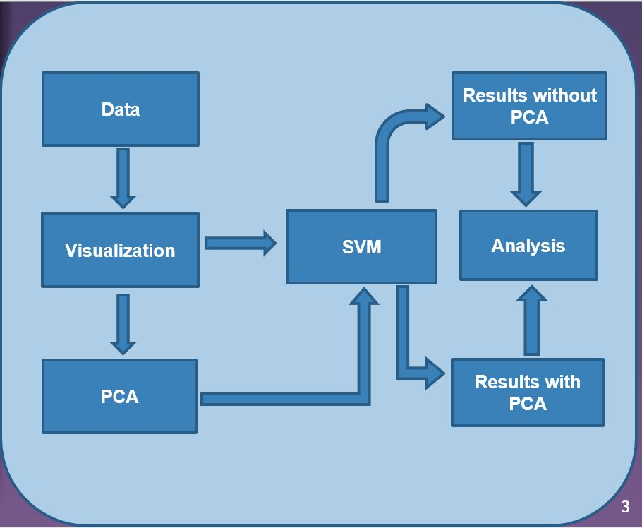
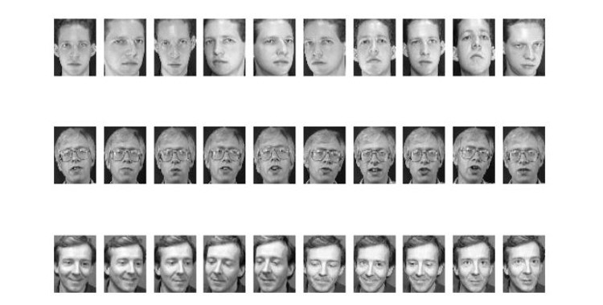
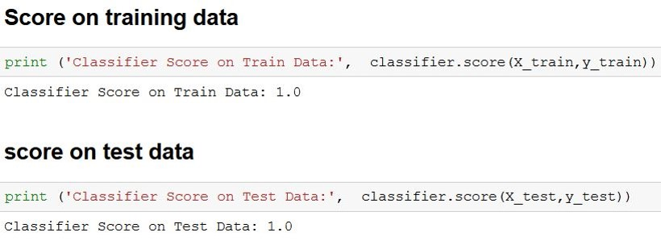
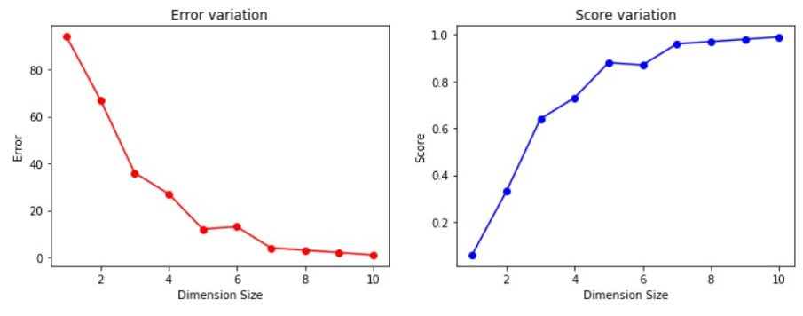

# PCA-SVM-Features-based-Face-Images-Classification

### Objectives:

    Face recognition on The Database of Faces at a glance.
    Data pre-processing.
    Dimension reduction using PCA.
    Support Vector Machines (For classification)

### Project work flow:

### Data-Set(The Database of Faces at a Glance):

    The data-set consists of 400 pictures of 40 people.
    Each picture has a dimension of 112X92 pixels.
    Data set comprises of pgm format.

Front faced pictures of a single subject was captured in different perspective & can be seen by plotting few examples of the given data-set. 

### Data pre-processing:

    Each image is flattened into row vector of size 10304.
    The size of whole data set becomes 400X10304.
    Then converted into a numpy ndarray.

### Dimension reduction using PCA:

    Redundant features are removed using PCA.
    Eigen vectors with more variance are kept while with low variance are discarded. 
    Output matrix from PCA will look noting like original image.

### Support Vector Machine(SVM):

    First of all for classification SVM is applied directly without using SVM.
    To get maximum margin, Linear classifier was used.
    100% accuracy was achieved.

### Score without using PCA:

When original numbers are used that is dimension reduction isn’t performed we have maximum score.

### SVM after using PCA:

    >PCA was implemented for K=1,2……10
    >For K=1 , error was 94%.
    >For K=10, error was 1%.
    >Significant improvements made when dimensions were increased.

### Results with PCA:
As we are increasing number of dimensions error is decreasing and score is increasing to one.

#### Denote:
Bitcoin: 3QFpMuvMcMaZ6cQUHqgrd2mDirz1JZi1W8
